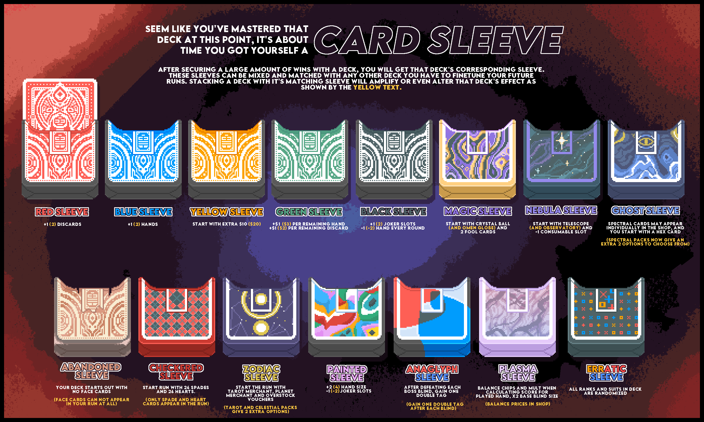

#  CardSleeves
A Steamodded+lovely Balatro Mod that adds Sleeves.

# Requirements
Requires `steamodded >= 1.0.0~ALPHA-0924a` - [link](https://github.com/Steamopollys/Steamodded/wiki/01.-Getting-started)

Requires `Lovely`, but this should already be installed as part of steamodded's installation process. If you do not have this, make sure you installed steamodded 1.0.0+ correctly.

# Installation
Get the latest stable version from the [Releases](https://github.com/larswijn/CardSleeves/releases/latest), then download and extract the zip.
Or use `git clone` for the latest development code, which is more up-to-date, but might be unstable.

Make sure to put the `CardSleeves` folder in the `Mods` directory, and that it is not nested.

# Features
Sleeves are run modifiers similar to decks. Any deck and sleeve can be combined.

CardSleeves adds 15 Sleeves by default, some of which have an unique and different effect when paired with their corresponding deck:
| Sleeve           | Base effect                                            | Unique effect                                                          |
|------------------|--------------------------------------------------------|------------------------------------------------------------------------|
| Red Sleeve       | +1 discards                                            | none                                                                   |
| Blue Sleeve      | +1 hands                                               | none                                                                   |
| Yellow Sleeve    | +$10                                                   | none                                                                   |
| Green Sleeve     | +$1 per remaining hand/discard                         | none                                                                   |
| Black Sleeve     | +1 joker slots, -1 hands                               | +1 joker slots, -1 discards                                            |
| Magic Sleeve     | Crystal Ball Voucher, 2 Fools                          | Omen Globe Voucher                                                     |
| Nebula Sleeve    | Telescope Voucher, -1 consumable slot                  | Observatory Voucher                                                    |
| Ghost Sleeve     | Spectral cards appear in shop, Hex card                | Spectrals appear more often in shop, Spectral pack size increases by 2 |
| Abandoned Sleeve | No Face Cards in starting deck                         | Face Cards never appear                                                |
| Checkered Sleeve | 26 Spades and 26 Hearts in starting deck               | Only Spades and Hearts appear                                          |
| Zodiac Sleeve    | Tarot Merchant, Planet Merchant and Overstock Vouchers | Arcana/Celestial pack size increases by 2                              |
| Painted Sleeve   | +2 hand size, -1 joker slots                           | none                                                                   |
| Anaglyph Sleeve  | Double Tag after each Boss Blind                       | Double Tag after each Small/Big Blind                                  |
| Plasma Sleeve    | Balance chips/mult, X2 base Blind size                 | Balance prices in shop                                                 |
| Erratic Sleeve   | All ranks/suits in starting deck are randomized        | Starting Hands/Discards/Dollars/Joker slots are randomized between 3-6 |

Other mods have the ability to add their own Sleeves! Some of these mods include:
+ [Cryptid](https://github.com/MathIsFun0/Cryptid)
+ [Familiar](https://github.com/RattlingSnow353/Familiar)
+ [SDM_0's Stuff](https://github.com/SDM0/SDM_0-s-Stuff)
+ [MoreFluff](https://github.com/notmario/MoreFluff)
+ [Reverie](https://github.com/dvrp0/reverie)
+ [Pokermon](https://github.com/InertSteak/Pokermon)
+ [Buffoonery](https://github.com/pinkmaggit-hub/Buffoonery)
+ [Themed Jokers](https://github.com/cerloCasa/Themed-Jokers)
+ [Jimbo's Pack](https://github.com/art-muncher/Jimbo-s-Pack)
+ [10Spades](https://github.com/TamerSoup625/balatro-ten-spades)

CardSleeves also has support for [Galdur](https://github.com/Eremel/Galdur)'s improved new run menu!

# API (for mod developers)
Any other mod can create new sleeves. See [the wiki](https://github.com/larswijn/CardSleeves/wiki) for more information.

# Credits
Big thanks to Sable for the idea and all the art, and the balatro modding community for helping out with the lua code.

Any suggestions, improvements or bugs are welcome and can be submitted through Github's Issues, or on the Balatro Discord [Thread](https://discord.com/channels/1116389027176787968/1279246553931976714).
